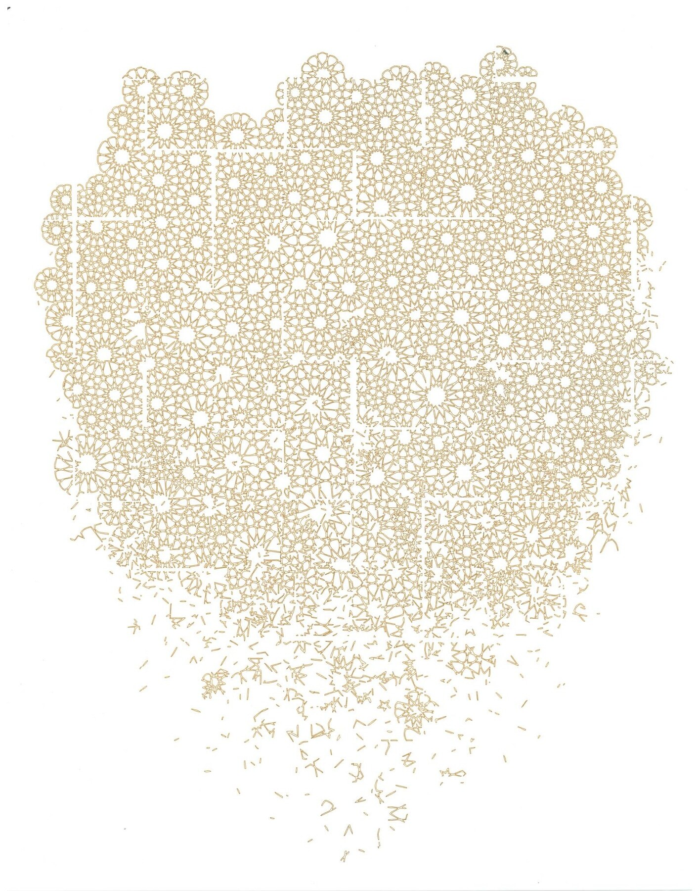
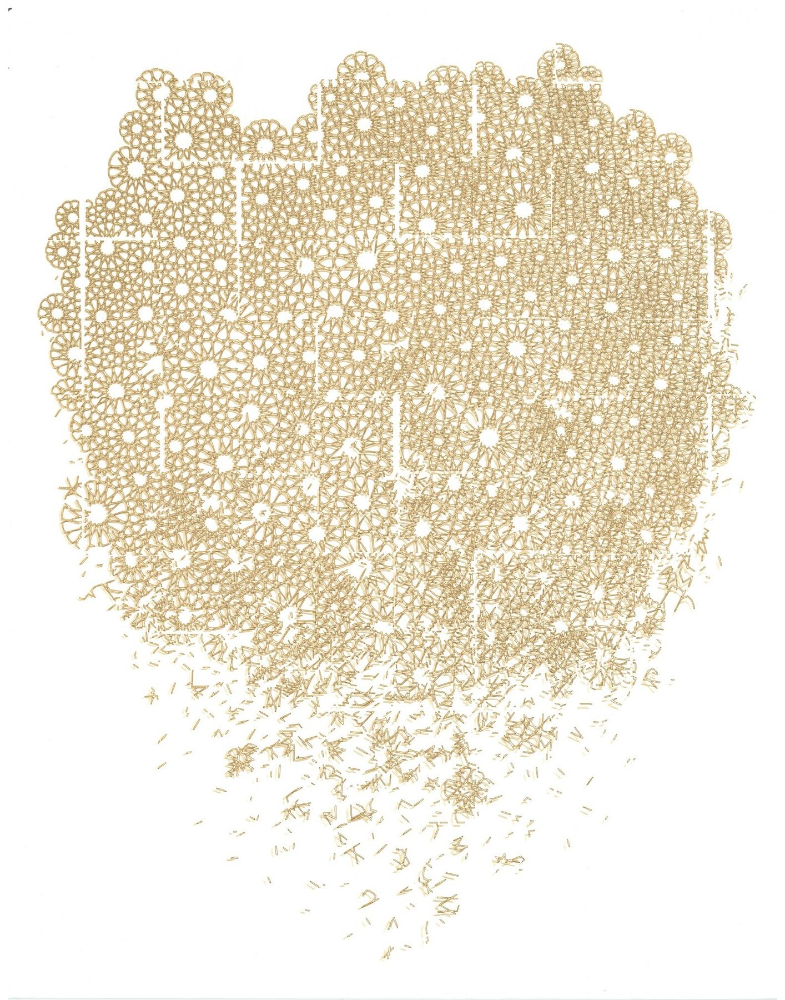

# Disintegrating: archived scan variants

Removed from the website carousel on October 7, 2026; retained here for documentation. Original scans, processed PDFs, and PSD masters are retained in the local working archive.

### Outline only — April 25, 2025

Universal laser; inventory D-2025-04-25-B. Two copies; neither is currently owned. Without a filled field, the pattern is carried by its contours and more of the paper remains open.

### Fill with offset outline — April 25, 2025

Universal laser; inventory D-2025-04-25-A. Private collection, Manaswi Mishra. The offset outline adds a second boundary around the filled pattern, giving the engraving a denser edge.

